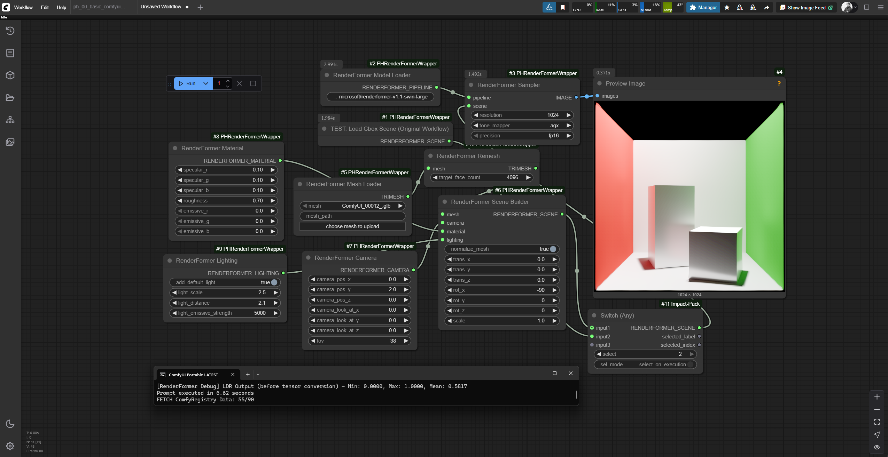
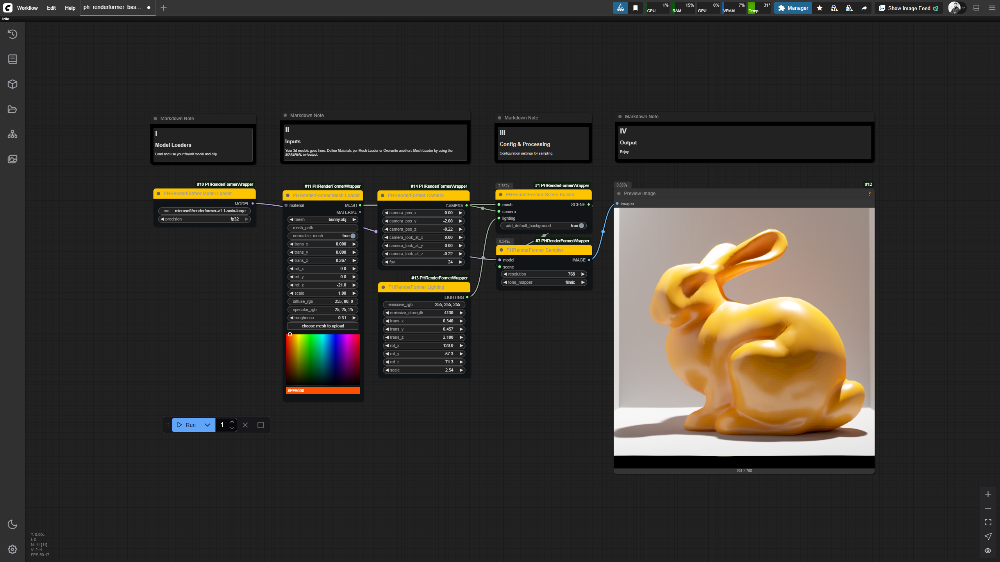
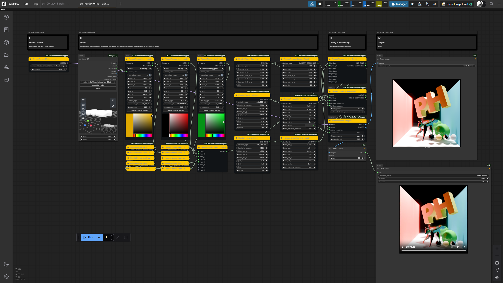
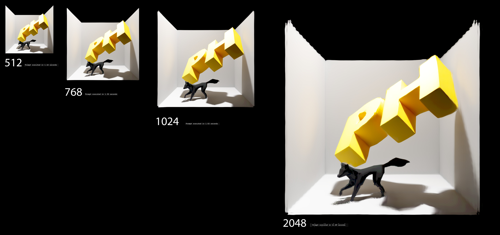

# ✨ ComfyUI-PHRenderFormerWrapper ✨

**Author:** paulh4x






This repository contains a set of custom nodes for ComfyUI that provide a wrapper for Microsoft's **RenderFormer** model. It allows you to render complex 3D scenes with physically-based materials and global illumination directly within the ComfyUI interface.

> [!WARNING]
> **WORK IN PROGRESS & HELLO WORLD:** This project is my first "hello world" in contributing code of any kind and is currently under active development. It should be considered experimental. I do not take responsibility if this breaks anything and do not plan to provide official support for it.

---

### 🚀 Features

-   **🎨 End-to-End Rendering:** Load 3D models, define materials, set up cameras, and render—all within ComfyUI.
-   **⚙️ Modular Node-Based Workflow:** Each step of the rendering pipeline is a separate node, allowing for flexible and complex setups.
-   **🎥 Animation & Video:** Create camera animations by interpolating between keyframes. The nodes output image batches compatible with ComfyUI's native video-saving nodes.
-   **🔧 Advanced Mesh Processing:** Includes nodes for loading, combining, remeshing, and applying simple color randomization to your 3D assets.
-   **💡 Lighting and Material Control:** Easily add and combine multiple light sources and control PBR material properties like diffuse, specular, roughness, and emission.
-   **↔️ Full Transformation Control:** Apply translation, rotation, and scaling to objects within the scene.
-   **⚡ In-Memory Processing:** The entire scene preparation pipeline, from loading meshes to generating the final HDF5 data for the model, is handled in-memory to maximize speed and avoid disk I/O.

---

### 📝 Progress & To-Do

This project is under active development. Here is a summary of the progress so far and the features planned for the future.

#### ✅ Done

-   **Core Rendering Pipeline:** All essential nodes for building and rendering a static 3D scene are implemented.
-   **In-Memory Processing:** The entire scene preparation pipeline is handled in-memory to maximize speed.
-   **Video Rendering:** A complete, dedicated workflow for video rendering is in place.
-   **Advanced Utilities:** Nodes for mesh combination, remeshing, and JSON-based scene loading are functional.
-   **Custom UI Elements:** The nodes feature custom colors for better visual organization, and progress bars are implemented for long-running operations.
-   **Bug Fixes:** Addressed various bugs related to file handling, data types, and temporary file management.

#### 📋 To Do

-   [ ] **Target Animation Nodes:** Implement animation capabilities for `MESH` and `LIGHT` properties, not just the camera.
-   [ ] **Camera Adoption:** Integrate with the `Load 3D` core node to adopt its camera transformations.
-   [ ] **Randomize Color Fix:** Investigate and fix the `RandomizeColors` node, which is not producing the expected visual output.
-   [ ] **Material Presets:** Create a system for saving and loading material presets.
-   [ ] **Public Release:** Prepare for a more stable, public release with better documentation and examples.

---

### ️ Installation

#### Prerequisites

-   **Git:** Required for cloning the repository and installing certain dependencies.
-   **Python:** A Python version compatible with ComfyUI and PyTorch 2.0+.
-   **PyTorch:** A compatible version of PyTorch must be installed for your hardware (NVIDIA CUDA or Apple Metal). This wrapper is tested with PyTorch 2.7.1 and CUDA 12.6.
-   **ComfyUI:** A working installation of ComfyUI.

#### Installation Steps

1.  Navigate to your ComfyUI `custom_nodes` directory:
    ```bash
    cd ComfyUI/custom_nodes/
    ```
2.  Clone this repository:
    ```bash
    git clone https://github.com/your-github-username/ComfyUI_PHRenderFormerWrapper.git
    ```
3.  Navigate into the newly cloned directory:
    ```bash
    cd ComfyUI_PHRenderFormerWrapper
    ```
4.  Clone the official Microsoft RenderFormer repository into this directory. It **must** be named `renderformer`:
    ```bash
    git clone https://github.com/microsoft/renderformer.git renderformer
    ```
5.  Install the required Python packages for this wrapper:
    ```bash
    pip install -r requirements.txt
    ```
6.  RenderFormer requires an additional plugin for handling HDR image formats. Run the following command to download it:
    ```bash
    python -c "import imageio; imageio.plugins.freeimage.download()"
    ```
7.  Restart ComfyUI.

> [!NOTE]
> For NVIDIA GPU users, the underlying RenderFormer library can optionally use **Flash Attention** for better performance. If you have it installed in your PyTorch environment, it should be used automatically.

---

### 📦 Nodes

This wrapper provides a comprehensive set of nodes to build 3D scenes.

#### Core Pipeline
-   **PHRenderFormer Model Loader**: Loads a specified RenderFormer model from Hugging Face or a local path.
-   **PHRenderFormer Scene Builder**: Assembles a final scene for single-image rendering from meshes, a camera, materials, and lighting.
-   **PHRenderFormer Sampler**: Executes the RenderFormer pipeline on an assembled scene to produce the final rendered image.

#### Video & Animation
-   **PHRenderFormer Camera Target**: Creates a camera animation sequence by interpolating between a start and end camera state (position, look-at, FOV).
-   **PHRenderFormer Video Scene Builder**: Assembles a sequence of scenes, one for each frame of a camera animation.
-   **PHRenderFormer Video Sampler**: Renders a sequence of scenes and outputs the frames as an image batch, ready to be connected to a "Save Video" node.

#### Scene Components
-   **PHRenderFormer Mesh Loader**: Loads a 3D mesh file (e.g., `.obj`, `.glb`). Includes a file upload button and serves as the primary node for defining an object's material and transformation.
-   **PHRenderFormer Camera**: Defines the camera's position, look-at target, and field of view (FOV).
-   **PHRenderFormer Material**: Defines the PBR material properties for a mesh. The diffuse color can be set using an interactive, canvas-based color picker.
-   **PHRenderFormer Lighting**: Creates a configurable emissive light source.

#### Utilities & Advanced
-   **PHRenderFormer Mesh Combine**: Combines multiple `PH_MESH` outputs into a single object list.
-   **PHRenderFormer Lighting Combine**: Combines multiple light sources into a single list for the scene builder.
-   **PHRenderFormer Remesh**: Simplifies the geometry of a mesh to a target face count using `pymeshlab`.
-   **PHRenderFormer Random Colors**: Applies random vertex colors to a mesh for creative effects or debugging.
-   **PHRenderFormer From JSON**: Loads a scene from a JSON definition, allowing for more complex and customized setups based on the original RenderFormer format.
-   **PHRenderFormer Example Scene**: A test node to quickly load one of the official RenderFormer example scenes.

---

### Version History

#### Version 0.4 Beta Test - UI/UX and Workflow Enhancements
-   **Examples:** added example workflows for ComfyUI.
-   **UI/UX:** All nodes now have custom colors for better visual organization in the graph. The header is yellow (`#FDC501`) and the body is anthracite (`#111417`).
-   **UI/UX:** Added progress bars to all long-running nodes (`SceneBuilder`, `VideoSceneBuilder`, `Sampler`, `VideoSampler`, `Remesh`) to provide real-time feedback.
-   **Workflow:** The `Remesh` node now processes all meshes in a list, not just the first one.
-   **Workflow:** The `SceneBuilder` nodes will no longer add the default background if a background mesh has already been loaded manually, preventing duplicates.
-   **Input Precision:** The `emissive_strength` input on the `Lighting` node now has a smaller step value for finer control.

#### Version 0.3 - Video Rendering and Stability
-   **Feature:** Added a complete, dedicated workflow for video rendering (`Camera Target`, `Video Scene Builder`, `Video Sampler`).
-   **Fix:** Resolved a `dacite.exceptions.MissingValueError` in the video scene builder.
-   **Fix:** Addressed `TypeError` and `FileNotFoundError` bugs related to temporary file handling in the video pipeline.
-   **Change:** Separated single-image and video workflows for improved stability and clarity.

#### Version 0.2 - Refinements and Fixes
-   **Feature:** The `LoadMesh` node now has a `RENDERFORMER_MATERIAL` output, allowing material properties to be shared.
-   **Feature:** Added default transformations for specific background meshes from the official examples.
-   **Change:** Increased input precision for rotation and scale transformations.

#### Version 0.1 - Initial Development
-   **Feature:** Established the core rendering pipeline and all essential nodes for building and rendering a static 3D scene.
-   **Feature:** Implemented in-memory scene processing to patch `trimesh` and `h5py`, avoiding slow disk I/O.
-   **Feature:** Added advanced utility nodes like `RemeshMesh`, `RandomizeColors`, and `FromJSON`.
-   **UI/UX:** Integrated a file uploader and a custom canvas-based color picker for a better user experience.

---

### 🌱 My Journey

This project represents my first steps into coding and open-source contribution. It was born out of a desire to learn and create. What started as a simple experiment has been a journey of discovery, and I'm excited to see where it goes. I would love to develop this project further with the help of the community and welcome any contributions or feedback.

### 🙏 Acknowledgements

This project would not be possible without the foundational work of others.

-   **RenderFormer**
    This project is a wrapper for the incredible **RenderFormer** model. All credit for the underlying rendering technology goes to the original authors: **Chong Zeng, Yue Dong, Pieter Peers, Hongzhi Wu, and Xin Tong**.
    -   [Official RenderFormer Project Page](https://microsoft.github.io/renderformer/)
    -   [Official RenderFormer GitHub](https://github.com/microsoft/renderformer)

-   **comfyui-hunyuan3dwrapper**
    Special thanks to **kijai** for their work on the `comfyui-hunyan3dwrapper`, which served as an invaluable reference and starting point for this project during its development in `vibecoding`.
    -   [ComfyUI-Hunyuan3DWrapper GitHub](https://github.com/kijai/ComfyUI-Hunyuan3DWrapper)

-   **ComfyUI_Fill-Example-Nodes**
    A huge thank you to **filliptm** for creating the `ComfyUI_Fill-Example-Nodes` repository. The advanced color picker in this project was implemented by adapting the excellent example code provided in that repo. It was an essential learning resource for understanding how to build custom UI elements in ComfyUI.
    -   [ComfyUI_Fill-Example-Nodes GitHub](https://github.com/filliptm/ComfyUI_Fill-Example-Nodes)
