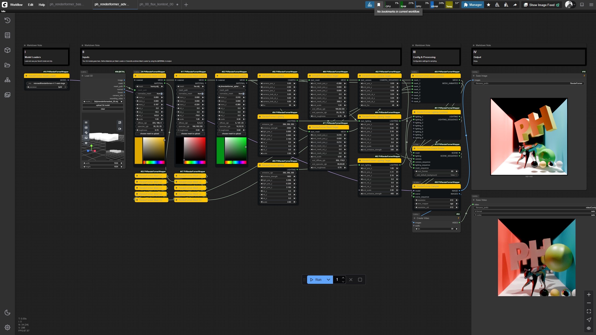
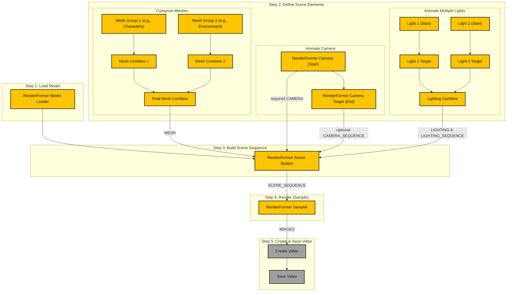

# ✨ ComfyUI-PHRenderFormerWrapper ✨

**Author:** paulh4x





This repository contains a set of custom nodes for ComfyUI that provide a wrapper for Microsoft's **RenderFormer** model. It allows you to render complex 3D scenes (see **Limits**) with physically-based materials and global illumination directly within the ComfyUI interface.


> [!WARNING]
> **WORK IN PROGRESS & HELLO WORLD:** This project is my first "hello world" in contributing code of any kind and is currently under active development. It should be considered experimental. The model is in a very early stage and may be further developed later. I do not take responsibility if this breaks anything and do not plan to provide official support for it.

---

### 💡 Usage

This node pack follows a standard 3D rendering pipeline. The basic workflow, as seen in the `ph_renderformer_basic_01.json` example, can be broken down into the following steps:


1.  **Load Model**: Start by loading the `RenderFormer Model Loader`. This node downloads the specified model from Hugging Face and prepares it for the pipeline.
2.  **Define Scene Elements**:
    *   **Mesh**: Use the `RenderFormer Mesh Loader` to load your 3D model (e.g., an `.obj` file). Here, you can also set its transformation (translation, rotation, scale) and define its core material properties. In the example, the output is passed to `RenderFormer Random Colors` for a creative effect.
    *   **Camera**: Add a `RenderFormer Camera` to define the viewpoint, target, and field of view.
    *   **Lighting**: Use the `RenderFormer Lighting` node to create one or more light sources. You can combine multiple lights with the `RenderFormer Lighting Combine` node.
3.  **Build Scene**: Connect the `MESH`, `CAMERA`, and `LIGHTING` outputs into the `RenderFormer Scene Builder`. This node collects all the components and assembles the final scene data that the model will render. You can also choose to add a default background plane and walls here.
4.  **Render (Sample)**: The `RenderFormer Sampler` takes the `MODEL` and the `SCENE` as input. It performs the actual rendering operation and outputs the final image.
5.  **Save Output**: Connect the `IMAGE` output from the sampler to a `Save Image` node to save the result.

For video, the workflow is similar. You would use a `RenderFormer Camera Target` to create a `CAMERA_SEQUENCE`, which then goes into the `RenderFormer Scene Builder`. The `RenderFormer Sampler` will automatically detect the sequence and output an image batch (`IMAGES`) ready for a video-saving node.

---

### 🚀 Advanced Usage: Building Complex Scenes & Multi-Light Animations

For more complex projects, you can combine multiple meshes and create sophisticated camera and lighting animations. The `ph_renderformer_advanced_01.json` workflow demonstrates this by building a scene with several object groups and animating multiple lights simultaneously.



1.  **Compose Your Scene**: Build complex scenes by loading multiple `RenderFormer Mesh Loader` nodes. Group them logically using `RenderFormer Mesh Combine` nodes. You can even chain `Combine` nodes together for highly organized, large-scale scenes.
2.  **Animate the Camera**: Define the starting view with a `RenderFormer Camera` node and the ending view with a `RenderFormer Camera Target` node.
3.  **Animate Multiple Lights**:
    *   For each light you want to animate, create a pair of `RenderFormer Lighting` (for the start state) and `RenderFormer Lighting Target` (for the end state) nodes.
    *   Feed all the `Lighting Target` outputs into a single `RenderFormer Lighting Combine` node. This node intelligently gathers all start and end states.
4.  **Build the Scene Sequence**:
    *   Connect your final combined `MESH` to the `RenderFormer Scene Builder`.
    *   Connect your starting `RenderFormer Camera` to the required `camera` input.
    *   Connect your `RenderFormer Camera Target` to the optional `camera_sequence` input.
    *   The `RenderFormer Lighting Combine` node provides two outputs. Connect its `LIGHTING` output to the required `lighting` input of the Scene Builder, and its `LIGHTING_SEQUENCE` output to the optional `lighting_sequence` input.
5.  **Render and Save**: The `RenderFormer Sampler` will receive the `SCENE_SEQUENCE` and render all frames, which can then be saved as a video.

---

### 🚀 Features

-   **🎨 End-to-End Rendering:** Load 3D models, define materials, set up cameras, and render—all within ComfyUI.
-   **⚙️ Modular Node-Based Workflow:** Each step of the rendering pipeline is a separate node, allowing for flexible and complex setups.
-   **🎥 Animation & Video:** Create camera and light animations by interpolating between keyframes. The nodes output image batches compatible with ComfyUI's native video-saving nodes.
-   **🔧 Advanced Mesh Processing:** Includes nodes for loading, combining, remeshing, and applying simple color randomization to your 3D assets.
-   **💡 Lighting and Material Control:** Easily add and combine multiple light sources and control PBR material properties like diffuse, specular, roughness, and emission.
-   **↔️ Full Transformation Control:** Apply translation, rotation, and scaling to any object or light in the scene.

---

### 🧱 Model Limits

-   **Meshes:** RenderFormer can handle scenes of up to 8192 polygons.
-   **Lights:** Up to 8 lightsources can be combined for lighting, emission color is for now limited to rgb 255, 255, 255 (white).
-   **Resolution:** Best tested resolutions for now are between 512 x 512 to 1024 x 1024 pixels. The model can produce resolutions up to 2048 x 2048 pixel, quality of outputs decrease with higher resolutions (see comparison img).
-   **Animations:** Due to slightly varying precision in each frame rendered, camera animations for now contain some flickering, especially with high reflective materials.

### 📝 Progress & To-Do

This project is under active development. Here is a summary of the progress so far and the features planned for the future.

#### ✅ Done

-   **Core Rendering Pipeline:** All essential nodes for building and rendering a static 3D scene are implemented.
-   **In-Memory Processing:** The entire scene preparation pipeline, from loading meshes to generating the final HDF5 data, is now handled in-memory. This significantly improves performance by avoiding slow disk I/O.
-   **Video Rendering:** A complete, dedicated workflow for video rendering is in place.
-   **Light Animation:** Full animation support for lights, including position, rotation, scale, and emission.
-   **Advanced Utilities:** Nodes for mesh combination, remeshing, and JSON-based scene loading are functional.
-   **Custom UI Elements:** The nodes feature custom colors for better visual organization, and progress bars are implemented for long-running operations.
-   **Bug Fixes:** Addressed various bugs related to file handling, data types, and temporary file management.
-   **Proper RGB Values for diffuse Color:** Colorpicker support for white-values for more variety of colors including.

#### 📋 To Do

-   [ ] **Randomize Color Fix:** Fix `RandomizeColors` node, will produce the expected visual output.
-   [ ] **Animation Flickering:** Investigate and fix flickering in animations, especially for objects with highly reflective materials.
-   [ ] **Mesh Format Support:** Add support for loading `.glb` and `.fbx` files, including their materials and textures.
-   [ ] **Mesh Animation:** Implement animation capabilities for `MESH` properties (translation, rotation, scale).
-   [ ] **Camera Adoption:** Integrate with the `Load 3D` core node to adopt its camera transformations.
-   [ ] **Material Presets:** Create a system for saving and loading material presets.
-   [ ] **Public Release:** Prepare for a more stable, public release with better documentation and examples.

---

### 🛠️ Installation

#### Prerequisites

-   **Git:** Required for cloning the repository and installing certain dependencies.
-   **Python:** A Python version compatible with ComfyUI and PyTorch 2.0+.
-   **PyTorch:** A compatible version of PyTorch must be installed for your hardware (NVIDIA CUDA or Apple Metal). This wrapper is tested with PyTorch 2.7.1 and CUDA 12.6.
-   **ComfyUI:** A working installation of ComfyUI.

#### Installation Steps

1.  Navigate to your ComfyUI `custom_nodes` directory:
    ```bash
    cd ComfyUI/custom_nodes/
    ```
2.  Clone this repository:
    ```bash
    git clone https://github.com/your-github-username/ComfyUI_PHRenderFormerWrapper.git
    ```
3.  Navigate into the newly cloned directory:
    ```bash
    cd ComfyUI_PHRenderFormerWrapper
    ```
4.  Clone the official Microsoft RenderFormer repository into this directory. It **must** be named `renderformer`:
    ```bash
    git clone https://github.com/microsoft/renderformer.git renderformer
    ```
5.  Install the required Python packages for this wrapper:
    ```bash
    pip install -r requirements.txt
    ```
> [!IMPORTANT]
> For owners of a **NVIDIA 50xx series GPU**, a dedicated requirements file is available. Please use the following command instead:
> ```bash
> pip install -r requirements_50xx.txt
> ```
6.  RenderFormer requires an additional plugin for handling HDR image formats. Run the following command to download it:
    ```bash
    python -c "import imageio; imageio.plugins.freeimage.download()"
    ```
7.  Restart ComfyUI.

> [!NOTE]
> For NVIDIA GPU users, the underlying RenderFormer library can optionally use **Flash Attention** for better performance. If you have it installed in your PyTorch environment, it should be used automatically.

---

### 📦 Nodes

This wrapper provides a comprehensive set of nodes to build 3D scenes.

#### Core Pipeline
-   **RenderFormer Model Loader**: Loads a specified RenderFormer model from Hugging Face or a local path.
-   **RenderFormer Scene Builder**: Assembles a scene from meshes, lighting, and camera inputs. It can handle both single camera inputs for static images and camera sequences for creating animations.
-   **RenderFormer Sampler**: Executes the RenderFormer pipeline on a scene or a sequence of scenes. It intelligently handles both single images and image batches for video, producing the final rendered output.

#### Scene Components
-   **RenderFormer Mesh Loader**: Loads a 3D mesh file (e.g., `.obj`, `.glb`). This node is also used to define an object's material properties and transformations.
-   **RenderFormer Camera**: Defines the camera's position, look-at target, and field of view (FOV).
-   **RenderFormer Lighting**: Creates a configurable emissive light source.

#### Animation
-   **RenderFormer Camera Target**: Creates a camera animation sequence by defining a start and end camera state (position, look-at, FOV).
-   **RenderFormer Lighting Target**: Creates a light animation sequence by defining a start and end light state (position, rotation, scale, and emission).

#### Utilities
-   **RenderFormer Mesh Combine**: Combines multiple `MESH` outputs into a single object list.
-   **RenderFormer Lighting Combine**: A powerful node that enables multi-light animation. It accepts any combination of static lights (`LIGHTING`) and animated lights (`LIGHTING_SEQUENCE`), and outputs a single, unified `LIGHTING_SEQUENCE` ready for the Scene Builder. It also outputs the `start_frame_lighting` separately for a direct, convenient connection.
-   **RenderFormer Remesh**: Simplifies the geometry of a mesh to a target face count using `pymeshlab`.
-   **RenderFormer Random Colors**: Applies random vertex colors to a mesh for creative effects or debugging.

#### Advanced & Experimental
-   **RenderFormer From JSON**: Loads a scene from a JSON definition, allowing for more complex and customized setups based on the original RenderFormer format.
-   **RenderFormer Example Scene**: A test node to quickly load one of the official RenderFormer example scenes.

---

### 📜 Version History

#### Version 0.5.0 - Workflow Optimization
-   **Workflow:** The animation workflow has been significantly simplified and made more robust. The `RenderFormerSceneBuilder` now has a **required** `lighting` input that explicitly defines the start-frame lighting.
-   **Workflow:** The `end_lighting` input on the `Scene Builder` has been **removed**. All lighting animation is now handled by the optional `lighting_sequence` input, which provides the end-frame state.
-   **Data Flow:** The `RenderFormerLightingTarget` and `RenderFormerLightingCombine` nodes have been updated to output a standardized `LIGHTING_SEQUENCE` dictionary (`{ "start_lights": [...], "end_lights": [...] }`), ensuring consistent data flow.
-   **Convenience:** The `RenderFormerLightingCombine` node now provides a separate `start_frame_lighting` output for a direct connection to the `Scene Builder`'s required `lighting` input, preserving a clean and logical graph.

#### Version 0.3.0 - Animation Overhaul and Performance Boost
-   **Feature: Full Light Animation:** The `RenderFormerLightingTarget` node now supports animating a light's position, rotation, scale, and emissive strength, enabling complex dynamic lighting effects.
-   **Fix: Animation Transformation:** Reworked the animation pipeline to correctly interpolate object and light transformations, ensuring smooth movement, rotation, and scaling.
-   **Performance: In-Memory Scene Generation:** The entire scene-building process now runs in-memory, dramatically reducing processing time by avoiding disk I/O for intermediate files.
-   **Workflow:** The `RenderFormer Sampler` and `Scene Builder` nodes now handle both static scenes and animation sequences more robustly.

#### Version 0.2.5 - Node Consolidation and Workflow Simplification
-   **Workflow:** Merged the `RenderFormerVideoSamplerBatched` into the main `RenderFormerGenerator` (now `RenderFormer Sampler`). The sampler now intelligently handles both single images and video sequences, with an optional `IMAGES` output.
-   **Workflow:** Merged the `RenderFormerVideoSceneBuilder` into the main `RenderFormerSceneBuilder`. The node now accepts both a single `CAMERA` and a `CAMERA_SEQUENCE`, with optional `SCENE` and `SCENE_SEQUENCE` outputs.
-   **Fix:** Resolved a critical `AttributeError` in the `RenderFormerSceneBuilder` caused by a missing helper method after the node merge.
-   **Fix:** Removed hardcoded material properties for background meshes in the `RenderFormerLoadMesh` node, ensuring that materials are always controlled by the node's inputs.
-   **UI/UX:** Added a colored startup message with an ASCII logo to provide clear feedback on whether the nodes loaded successfully.
-   **UI/UX:** Fixed a `SyntaxWarning` related to escape sequences in the startup message.

#### Version 0.2.21 Beta Test - UI/UX and Workflow Enhancements
-   **Examples:** added example workflows for ComfyUI.
-   **UI/UX:** All nodes now have custom colors for better visual organization in the graph. The header is yellow (`#FDC501`) and the body is anthracite (`#111417`).
-   **UI/UX:** Added progress bars to all long-running nodes (`SceneBuilder`, `VideoSceneBuilder`, `Sampler`, `VideoSampler`, `Remesh`) to provide real-time feedback.
-   **Workflow:** The `Remesh` node now processes all meshes in a list, not just the first one.
-   **Workflow:** The `SceneBuilder` nodes will no longer add the default background if a background mesh has already been loaded manually, preventing duplicates.
-   **Input Precision:** The `emissive_strength` input on the `Lighting` node now has a smaller step value for finer control.

#### Version 0.1.9 - Video Rendering and Stability
-   **Feature:** Added a complete, dedicated workflow for video rendering (`Camera Target`, `Video Scene Builder`, `Video Sampler`).
-   **Fix:** Resolved a `dacite.exceptions.MissingValueError` in the video scene builder.
-   **Fix:** Addressed `TypeError` and `FileNotFoundError` bugs related to temporary file handling in the video pipeline.
-   **Change:** Separated single-image and video workflows for improved stability and clarity.

#### Version 0.1.5 - Refinements and Fixes
-   **Feature:** The `LoadMesh` node now has a `RENDERFORMER_MATERIAL` output, allowing material properties to be shared.
-   **Feature:** Added default transformations for specific background meshes from the official examples.
-   **Change:** Increased input precision for rotation and scale transformations.

#### Version 0.1.0 - Initial Development
-   **Feature:** Established the core rendering pipeline and all essential nodes for building and rendering a static 3D scene.
-   **Feature:** Implemented in-memory scene processing to patch `trimesh` and `h5py`, avoiding slow disk I/O.
-   **Feature:** Added advanced utility nodes like `RemeshMesh`, `RandomizeColors`, and `FromJSON`.
-   **UI/UX:** Integrated a file uploader and a custom canvas-based color picker for a better user experience.

---

### 🌱 My Journey

This project represents my first steps into coding and open-source contribution. It was born out of a desire to learn and create. What started as a simple experiment has been a journey of discovery, and I'm excited to see where it goes. I would love to develop this project further with the help of the community and welcome any contributions or feedback.

### 🙏 Acknowledgements

This project would not be possible without the foundational work of others.

-   **RenderFormer**
    This project is a wrapper for the incredible **RenderFormer** model. All credit for the underlying rendering technology goes to the original authors: **Chong Zeng, Yue Dong, Pieter Peers, Hongzhi Wu, and Xin Tong**.
    -   [Official RenderFormer Project Page](https://microsoft.github.io/renderformer/)
    -   [Official RenderFormer GitHub](https://github.com/microsoft/renderformer)

-   **comfyui-hunyuan3dwrapper**
    Special thanks to **kijai** for their work on the `comfyui-hunyan3dwrapper`, which served as an invaluable reference and starting point for this project during its development in `vibecoding`.
    -   [ComfyUI-Hunyuan3DWrapper GitHub](https://github.com/kijai/ComfyUI-Hunyuan3DWrapper)

-   **ComfyUI_Fill-Example-Nodes**
    A huge thank you to **filliptm** for creating the `ComfyUI_Fill-Example-Nodes` repository. The advanced color picker in this project was implemented by adapting the excellent example code provided in that repo. It was an essential learning resource for understanding how to build custom UI elements in ComfyUI.
    -   [ComfyUI_Fill-Example-Nodes GitHub](https://github.com/filliptm/ComfyUI_Fill-Example-Nodes)
