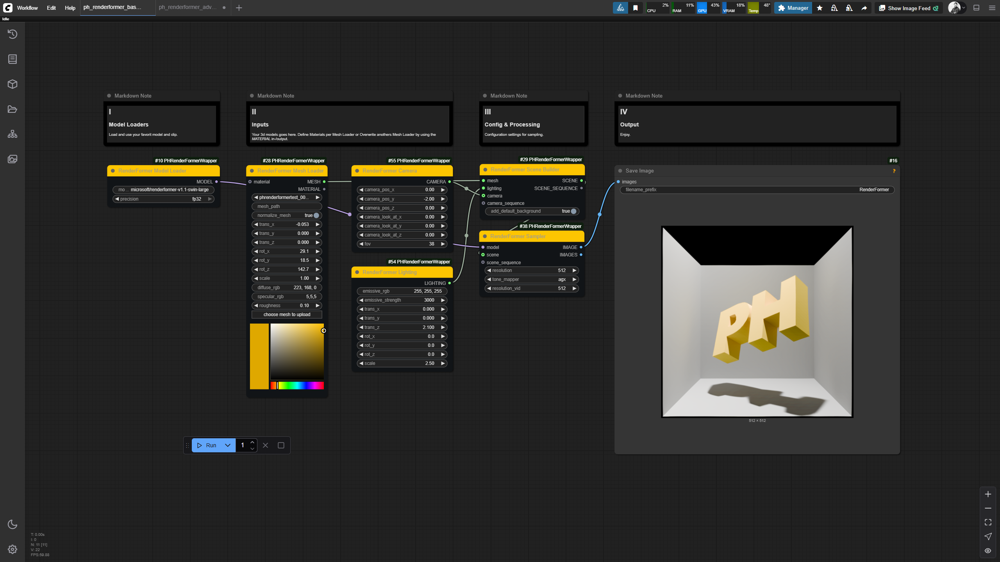

# ✨ ComfyUI-PHRenderFormerWrapper ✨

**Author:** paulh4x





> [!WARNING]
> **WORK IN PROGRESS:** This project is currently under active development and should be considered experimental. It will be officially released as soon as it is stable.

This repository contains a set of custom nodes for ComfyUI that provide a wrapper for Microsoft's **RenderFormer** model. It allows you to render complex 3D scenes with physically-based materials and global illumination directly within the ComfyUI interface.

---

### 🌱 My Journey

This project represents my very first baby steps into the world of coding and my first-ever contribution to the open-source community. ❤️ It was born out of a desire to learn and create, fueled by late-night sessions of what can only be described as "vibecoding."

What started as a simple experiment quickly grew into a passion project. It has been a journey of discovery, filled with challenges, learning, and the immense satisfaction of seeing an idea come to life. I hope this wrapper brings as much utility and fun to your projects as it has brought me in building it. Thank you for being a part of my story!

---

### Version 0.2 - Refinements and Fixes

This version focuses on improving the usability and stability of the nodes, with several key refinements and bug fixes.

**Key Features & Accomplishments:**

*   **Material Output:** The `LoadMesh` node now has a `RENDERFORMER_MATERIAL` output, allowing you to pipe the material from one mesh to another.
*   **Default Transformations:** When loading specific background meshes from the `cbox-bunny.json` example (`plane.obj`, `wall0.obj`, `wall1.obj`, `wall2.obj`), the node now automatically applies the correct transformation values.
*   **Increased Precision:** The precision for rotation and scale inputs has been increased for finer control over transformations.
*   **Bug Fixes:** Resolved an out-of-memory error that could occur with high-resolution rendering or complex scenes.

### Version 0.1 - Initial Development

This initial version of the PHRenderFormerWrapper lays the foundation for rendering 3D scenes within ComfyUI. The focus was on establishing the core architecture, implementing a comprehensive set of nodes for scene construction, and creating a flexible, user-friendly workflow.

**Key Features & Accomplishments:**

*   **Core Rendering Pipeline:**
    *   `RenderFormerModelLoader`: Loads the RenderFormer model from Hugging Face.
    *   `RenderFormerGenerator`: The main sampler node that renders the final image from a scene.
    *   **In-Memory Scene Processing:** The entire scene-to-HDF5 conversion process is handled in memory, patching `trimesh` and `h5py` to avoid slow disk operations and temporary files. This is a key performance and efficiency feature.

*   **Modular Scene Construction:**
    *   `LoadMesh`: Loads `.obj`, `.glb`, and other 3D files. Also acts as the central point for defining PBR materials.
    *   `RenderFormerCamera`: Defines camera position, target, and FOV.
    *   `RenderFormerLighting`: Creates an emissive light source with configurable properties.
    *   `RenderFormerSceneBuilder`: Assembles all components (meshes, materials, camera, lights) into a final scene ready for rendering.

*   **Advanced Node Functionality:**
    *   `RenderFormerMeshCombine`: Allows for combining multiple `PH_MESH` objects into a single scene.
    *   `RenderFormerLightingCombine`: Allows for combining multiple light sources.
    *   `RemeshMesh`: Simplifies mesh geometry to a target face count using `pymeshlab`.
    *   `RandomizeColors`: A utility node to apply a deterministic, gradient-based color pattern to a mesh's faces, useful for debugging and creative effects.
    *   `RenderFormerFromJSON` & `LoadRenderFormerExampleScene`: Provides advanced methods for loading scenes directly from JSON definitions or the original RenderFormer example files.

*   **UI/UX Enhancements:**
    *   **File Uploader:** The `LoadMesh` node includes a convenient "choose mesh to upload" button.
    *   **Advanced Color Picker:** The `diffuse_rgb` string input was replaced with a custom, canvas-based interactive color picker for a much better user experience.
    *   **High-Precision Transforms:** All transform inputs (translation, rotation, scale) were given high precision for fine-grained control.

### 🚀 Features

-   **🎨 End-to-End Rendering:** Load 3D models, define materials, set up cameras, and render—all within ComfyUI.
-   **⚙️ Modular Node-Based Workflow:** Each step of the rendering pipeline is a separate node, allowing for flexible and complex setups.
-   **🔧 Advanced Mesh Processing:** Includes nodes for loading, combining, remeshing, and applying simple color randomization to your 3D assets.
-   **💡 Lighting and Material Control:** Easily add default light sources and control PBR material properties like diffuse, specular, roughness, and emission.
-   **↔️ Full Transformation Control:** Apply translation, rotation, and scaling to objects within the scene.

### 🛠️ Installation

1.  Navigate to your ComfyUI `custom_nodes` directory:
    ```bash
    cd ComfyUI/custom_nodes/
    ```
2.  Clone this repository:
    ```bash
    git clone <repository_url> ComfyUI_PHRenderFormerWrapper
    ```
3.  Install the required dependencies:
    ```bash
    cd ComfyUI_PHRenderFormerWrapper
    pip install -r requirements.txt
    ```
4.  Restart ComfyUI.

### 📦 Nodes

-   **PHRenderFormer Model Loader**: Loads a specified RenderFormer model from Hugging Face or a local path.
-   **PHRenderFormer Mesh Loader**: Loads a 3D mesh file (e.g., `.obj`, `.glb`). Includes a file upload button to add models directly to your `ComfyUI/input/3d` directory.
-   **PHRenderFormer Mesh Combine**: Combines multiple meshes into a single scene object.
-   **PHRenderFormer Remesh**: Simplifies the geometry of a mesh to a target face count using `pymeshlab`.
-   **PHRenderFormer Random Colors**: Applies random vertex colors to a mesh for creative effects.
-   **PHRenderFormer Camera**: Defines the camera's position, look-at target, and field of view (FOV).
-   **PHRenderFormer Material**: Defines the PBR material properties for a mesh. The diffuse color can be set using an interactive, canvas-based color picker within the `PHRenderFormer Mesh Loader` node.
-   **PHRenderFormer Lighting**: Controls the scene's lighting, allowing you to add and configure a default emissive light source.
-   **PHRenderFormer Scene Builder**: Assembles the final scene by combining meshes, a camera, materials, lighting, and transformations.
-   **PHRenderFormer Sampler**: Executes the RenderFormer pipeline on the assembled scene to produce the final rendered image.
-   **PHRenderFormer From JSON**: Loads a scene from a JSON definition, allowing for more complex and customized setups.

### 🙏 Acknowledgements

This project would not be possible without the foundational work of others.

-   **RenderFormer**
    This project is a wrapper for the incredible **RenderFormer** model. All credit for the underlying rendering technology goes to the original authors: **Chong Zeng, Yue Dong, Pieter Peers, Hongzhi Wu, and Xin Tong**.
    -   [Official RenderFormer Project Page](https://microsoft.github.io/renderformer/)
    -   [Official RenderFormer GitHub](https://github.com/microsoft/renderformer)

-   **comfyui-hunyuan3dwrapper**
    Special thanks to **kijai** for their work on the `comfyui-hunyan3dwrapper`, which served as an invaluable reference and starting point for this project during its development in `vibecoding`.
    -   [ComfyUI-Hunyuan3DWrapper GitHub](https://github.com/kijai/ComfyUI-Hunyuan3DWrapper)

-   **ComfyUI_Fill-Example-Nodes**
    A huge thank you to **filliptm** for creating the `ComfyUI_Fill-Example-Nodes` repository. The advanced color picker in this project was implemented by adapting the excellent example code provided in that repo. It was an essential learning resource for understanding how to build custom UI elements in ComfyUI.
    -   [ComfyUI_Fill-Example-Nodes GitHub](https://github.com/filliptm/ComfyUI_Fill-Example-Nodes)